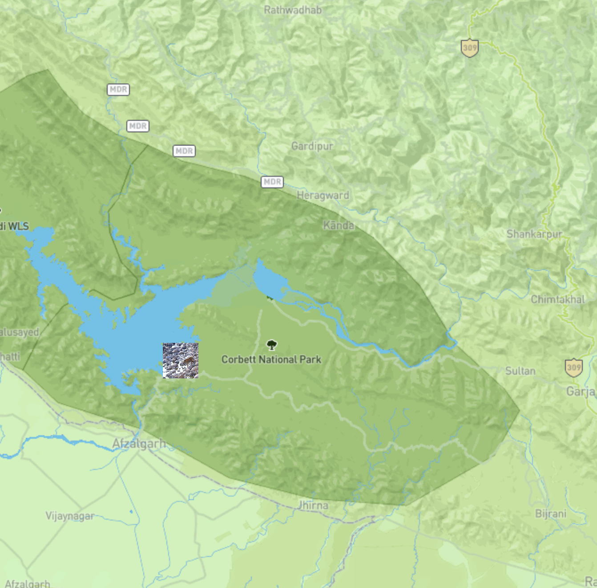
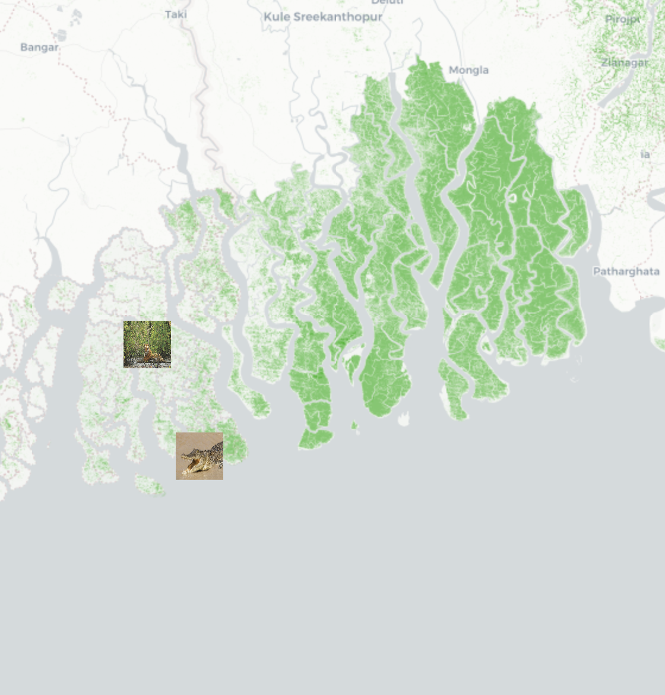

# Geog 458: Essay
# Analysis of the project: National Parks in India
## Github repository link: https://github.com/parthw98/NationalParksInIndia

<a href="https://parthw98.github.io/NationalParksInIndia/">National Parks Webmap</a>

### Introduction
<p> This project is a story map which illustrates major national parks in India and shows the users different national parks and wildlife sancturies in the Indian subcontient. The goal of this project is to provide information about different national parks in the country, provide their location, text information and pictures which provides greater knowledge and understanding of the wildlife, nature, flora, and fauna India has to offer. This project was made with the intention of providing an informative experience to web users across the globe helping them get insights and useful understanding about different national parks that can be visited and experienced in India with a snippet into what each national park is like. </p>
<p> This web map experience was designed keeping different user groups in mind with a special focus on Bengal tiger enthusiasts. The target audience for this storymap is tourists and visitors from not only India but also various countries across the globe. Wildlife enthusiasts and endangered species spotters, along with wildlife photographers and documentators, will specially find this website interesting as it provides written information as well as pictures from different national parks.</p>
<p> It is created by Parth Wanage(me), senior year geography major student, from the University of Washington, Seattle. I have chosen the Geographic Information Systems track at the Department of Geography, UW, as maps have always fascinated me since childhood. </p>
<p>This project produces a story map written with storymap.js and leaflet libraries. It includes javascript and CSS (Cascading Style Sheets) that are inherited in a HTML document which exercises the required codes in order to produce an interactive and informative mapping experience for the user. The major functions of this project utilize the storymap javascript library, jquery, and the leaflet library in order to create a story map with their proerties and inherited functions. The class <code>col-sm-6 col-md-4 storymap-story </code> inherts the written text and the images seen in the left column of the map while the class <code>col-sm-6 col-md-8 storymap-map </code> hosts the map and its styling and placement functions. </p>

### Description
##### Servers
<p> The client codes, files, images, and texts are hosted on a server on Github repository and the storymap is visible on the server. The client platform is updated using Atom and is hosted on the Github repository, while Github plays an important role in linking the client and the server platforms. Atom is the local server editor used in coding, manipulating and visualizing the data and making any required changes to the interactive webmap and its corrosponding page. The internal network of file and database servers is uploaded on the external Github platform in order to make it a open source for the benefit of the GIS community. The internal network initially hosted the file server which involved files and folders like assets, img, js, css etc. while the database server was absent as data was externally linked from the world wide web. The geospatial server hosted the code on Atom and git commands of <code>git clone</code> and <code>git push</code> were used to make contact and upload files to the web client server.</p>


>These servers interact and complement each other in forming a chain to pass functions and codes in order to gain a desired outcome on the website.

<p> The above image describes the relationship and connections between different servers that constitute in the execution of the code in order to produce the desired outcome on the story map. The geospatial server is one of particular interest for this course as it combines local files and data in formats like geojson to produce a systematic code which is then transfered to the web client like Github through the web server, for open use, manipulation and access. </p>

##### Programming and Code Elements

<p>The data flow in this code is linear and immediate as variables have to be created initially in order to be used in different functions. The data is used from the assets folder which was initially created locally before being pushed to the repository, and the data is initially saved in local client files to be utilized by the server for reaching its desired goals. This transfer has to migrate through the logic tier therefore has to have a logical form of interpretation in order to displayed on the presentation tier. The css and javascript folders are written and saved on a local client, these are prewritten classes to be implemented into the html code. This does not only save space and mae the html code more readable but also reduces the size of the data by distributing it into different folders.</p>

<p> Code is the main component for obtaining the desired output and creating the desired design on the story map. This map uses the <code> storymap.js </code> library at the center of its execution as it gives the program its definite structure and communicates with the browser and the computer to run codes and implement actions in a certain way. The placement of objects, alignment of contents, use of images and texts, and placement of coordinates, icons, and data points is implemented by the program and the various libraries it inherits in its <code>head</code> section.</p>

```
<link rel="stylesheet" href="https://maxcdn.bootstrapcdn.com/bootstrap/4.3.1/css/bootstrap.min.css">
    <!--leaflet css-->
    <link rel="stylesheet" href="https://cdnjs.cloudflare.com/ajax/libs/leaflet/1.4.0/leaflet.css">
    <link rel="stylesheet" href="https://cdnjs.cloudflare.com/ajax/libs/animate.css/3.5.2/animate.min.css">
    <link rel="stylesheet" href="https://fonts.googleapis.com/icon?family=Material+Icons">
    <link rel="stylesheet" href="https://use.fontawesome.com/releases/v5.7.2/css/all.css">


    <!--add favicon for the web page-->
    <link rel="shortcut icon" href="../../img/favicon.ico" type="image/x-icon">

    <!--Fonts-->
    <link href="https://fonts.googleapis.com/css?family=Cairo" rel="stylesheet">


    <link rel="stylesheet" type="text/css" href="css/storymap.2.5.css">
    <!--add required libraries-->

    <script src="https://cdnjs.cloudflare.com/ajax/libs/leaflet/1.4.0/leaflet.js"></script>
    <!--jquery-->
    <script src="https://cdnjs.cloudflare.com/ajax/libs/jquery/3.2.1/jquery.min.js"></script>
    <script src="https://cdnjs.cloudflare.com/ajax/libs/popper.js/1.14.0/umd/popper.min.js"></script>

    <!--boostrap-->
    <script src="https://maxcdn.bootstrapcdn.com/bootstrap/4.3.1/js/bootstrap.min.js"></script>
    <!--leaflet.ajax for asynchronously adding geojson data-->
    <script src="https://cdnjs.cloudflare.com/ajax/libs/leaflet-ajax/2.1.0/leaflet.ajax.min.js"></script>

    <!--mini globle map-->
    <script src="https://cdnjs.cloudflare.com/ajax/libs/d3/3.5.5/d3.min.js"></script>
    <script src="https://cdnjs.cloudflare.com/ajax/libs/topojson/1.6.19/topojson.min.js"></script>
    <script src="../../js/globeminimap.js"></script>

    <!--story map plugin-->
    <script src="js/storymap.2.5.js"></script>
```

<p>These are the various libraries, plugins, and references used in order to run the storymap program. It involves various leaflet CSS stylesheets to provide the design and aesthetic beauty to the web page. Various classes can be directly used from there stylesheets,css, and js folders directly into to the code for better performance and easy use. Jquery is another libary implemented in order to use geospatial data and process geojson files. This library provides functions to directly implement spatial data coordinates, locational geojson files etc. into the code and directly serve the desired purpose. The storymap plugin is an important reference as it helps in the creation of this story map and provides classes and functions in order to systematically execute a sequence and provide it in the form of a story line.</p>

<p> This project also provides interactive features as certain design elements respond to mouse clicks and keyboard keys. For example the icons execute the pop-up. </p>
```
corbett1: {
  layer: L.marker([29.543507, 78.792741],
    {icon:corbettIcon1}).bindPopup('',
    {maxWidth: "auto"})},
```
>This map also uses images as icons for better understanding and improving user experience.
<p> The <code>bindPopup</code> function inherited from leaflet provides a mouse interaction with the icon and gives an enlarged image when clicked. This helps the user view the image icons in a highlighted larger format imcreasing his satisfasction with the map design. </p>

### Data Sources
<p> This project does not use any complicated data sources and sticks to simple coordinates, basemaps and their respective tiles, images, and text information in order to create a simple but interactive and user friendly experience for the user. The following table provides the data sources used.</p>

| Data        | Usage           | Type  |
| ------------- |:-------------:| -----:|
| text information      | description purposes | raster |
| images      | visualization     |   raster |
| coordinates | locational      |    vector |
| maptiles    | reference     | raster |

<p> The above vector as well as raster data sources provided an overall enriching user experience and pop-ups help in creating user interaction. The User interface is viberant and constitutes of beoth visual images which provide a visual understanding of the fauna that can be spotted at these national parks and provide the user with a pleasant visual delight of the wild forests sitting in concrete buildings with noise, air pollution, etc. giving them an escape into the wild from their regular lives. </p>
<p> The User interface also provides textual information to the user, providing him the knowledge about this place and giving him an idea of the relevance and importance of this national park for the animals, as well as the local people and tourists. The Web mapping design is of a classic story map by providing information in te form of text and image on the left that constitute the content of the map, while the right side of the web page displays the map. The map provides a geographic understanding of the location of the national park and provides a spatial reference to the user. This system of the story map helps the user gain textual knowledge on the left side with visual representation on the right giving an hollistic approach to learning and the growth of knowledge. </p>

### Design and Built
**Basemaps** provide the basic layer or the foundation to the web map. It is the first layer which provide a cordinate system and reference parameters on which other layers are projected. This layer decides the orientation of the map and the vector directions. This project includes various baselayers.
- _forestbase_ - This is a baselayer which I created using Mapbox studio, and styled its color, design, and other elements using the different features Mapbox had to offer. This baselayer can be later tiled using QGIS and converted into a raster format. I purposely used light and dar green color combination  in order to contrast the national park and its boundaries from the rest of the map. The roads and highways were purposely lightened in order to prevent the shift of focus and the labels were kept as light as possible so the user gets an idea which region and geographic location is being viewed as well as the national parks and their names have been highlighted. This basemap has been used for the Jim Corbett, Ranthambore, and Gir maps in the storyline.

-  _satellite_ - The satellite basemap was also refered from mapbox tiles API, and gave a satellite image of the region desired to be displayed. This basemap uses the satellite images of google earth which automatically differentiates between the green forest pastures and the yellow civilized territory. This gives a realistic approach to the storymap as it uses tiled images of the earth as the basemap for thematic layers. In addition, it marks and describes the terrain of the map as visible from space showing mountains, elevated surfaces, lakes, depressions etc. The satellite map is the nasemap for the Kanha national park map representation.

-  _ESRI_ - The ESRI basemap that is refered in this project also inherits the same qualities of the satellite basemap as both are spatial images of the earth that have been converted into tile layers. The ESRI map viberantly demonstrates the greenery and pastures and is more high definition in comparsion to the satellite basemap as it is taken from Google Earth, a high definition mapping and user friendly software as well as browser. This basemap is used for the Kaziranga national park.

-  _GEE_ - The GEE basemap is one of my favorite basemaps from this project as it is only built with two colors white and green. This helps in the easy differentiation of the forest area from the rest. This map only highlights the forest area in different parts of the world and its raster tiles are helpful in marking and visualizing the national parks in different regions. This provides a light baselayer which helps in highlighting the thematic layers which serve the main purpose of the story line. The Sundarbans National Park map is made using this baselayer.
 
